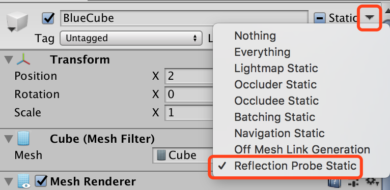

#反射探针ReflectionProbe

##ReflectionProbeBaked

ReflectionProbeBaked演示了烘焙反射探针的用法：

1. 创建一个Sphere和一个Material，将Material设置为全反射并赋予该Sphere。
2. 创建反射探针，设置为Baked模式：
3. 创建如图环境并将Ground，Wall，RedCube和BlueCube设置为ReflectionProbeStatic： 
4. 烘焙场景。
5. 运行场景，按左右键移动小球。

## ReflectionProbeRealtime

ReflectionProbeRealtime演示了实时反射探针的用法：

1. 复制ReflectionProbeBaked场景，重命名为ReflectionProbeRealtime。
2. 将反射探针设置为realtime，RefreshMode设置为Everyframe模式：
3. 将Ground，Wall，RedCube和BlueCube的ReflectionProbeStatic去掉。 
4. 运行场景，按左右键移动小球。